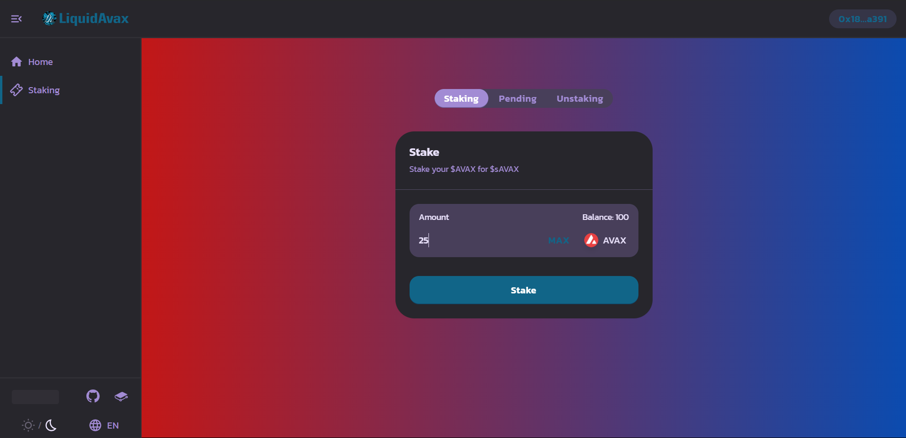

# Liquid Avax

## Quick prensentation

#### What is liquid staking ?

Liquid staking is an alternative to staking. The advantage of liquid staking is that staked asset are not locked anymore, while still earning returns and supporting decentralisation.

#### How does it work ?

Using the interface, the user is able to stake his $AVAX and get $sAVAX in exchange at a 1:1 rate. The user can also monitor all its current stakes if the stake is not finished yet and/or not withdrew by the backend. To redeem the funds, the user will need to provide back the $sAVAX tokens against what he will get his $AVAX again with the staking rewards.

### Let's present the project more in depth...

This project is composed of several components:

1. Frontend
2. Smart Contract
3. Backend

#### Frontend

The frontend, or user interface is our platform called "Liquid Avax". We forked Olive Swap, a fork of Pancake Swap for the sake of simplicity, and security on Avalanche. Here are a quick preview of our frontend:




#### Smart Contract

The smart contract is based on ERC20 smart contracts. It handles requests made by the frontend, and emits events for the backend.

#### Backend

The backend is basically a nodeJS script running 24/7 waiting for an Event such as "Staked" or "StakeEnded" to be emitted from the smart contract.

When the event "Staked" is emitted, it will retrieve the staker address, the stakeID, and the amount of $AVAX staked from it. This will be used to transfer the funds from the C to P chain and stake the funds on a node for a defined amount of time.

When the event "StakeEnded" is detected, the user will be able to redeem the funds. The backend will cross chain from P to C and send the funds to the smart contract.

## Tutorial

Okay, we hope that you are now full set to go through the tutorial. We will start by the smart contract.

Find the code on Github:

Smart contracts: [https://github.com/Syavel/AvalancheTuto/tree/main/contracts](https://github.com/Syavel/AvalancheTuto/tree/main/contracts)

Backend: [https://github.com/Syavel/AvalancheTuto/tree/main/Backend](https://github.com/Syavel/AvalancheTuto/tree/main/Backend)

Frontend: [https://github.com/iFrostizz/fluidavax-frontend/tree/devel](https://github.com/iFrostizz/fluidavax-frontend/tree/devel)

UI kit: [https://github.com/iFrostizz/fluidavax-uikit](https://github.com/iFrostizz/fluidavax-uikit)

SDK: [https://github.com/iFrostizz/fluidavax-sdk](https://github.com/iFrostizz/fluidavax-sdk)

### Smart contract

We start by importing the basic ERC20 smart contract \(this is a common standart for creating tokens, more details here :\) and the Ownable one \(this is a contract wich permit to restrain function to an owner adress\).

```text
pragma solidity ^0.8.0;

import "ERC20.sol";
import "Ownable.sol";
```

Then we need to write 4 main functions :

* One when a user deposit AVAX and mint sAVAX
* One to permit the backend to withdraw this funds
* One for the backend to put back fund + rewards on the contract
* And one to permit the user to get their funds back in exchange of sAVAX

In addition for clarity and reliability we will also need :

* One function to make the P-Chain tx viewable on C-chain \(updated by the backend\)
* One view function to view all stakes by an user
* One function to update some variables \(as minimum staking time etc when future gouvernance changes it\)

We will also need some variables to stock the staking informations : We willuse a struct to store all informations relative to a stake :

```text
struct Stake{
    address payable user;
    uint256 stakeId ;
    uint256 amount ;
    uint256 finalAmount ;
    uint256 endingTimestamp ;
    bool withdraw ;
    bool updated ;
    bool redeemed ;
    string PChainTx ;
}
```

and we will use a mapping to link an id to a stake and a int containing the number of stake:

```text
uint256 public stakeNumber = 0;
mapping (uint256 => Stake) public stakeds ;
```

To make frontend call easier we will also link an adress with all his stakes ids :

```text
mapping(address=>uint256[]) public currentStakedByUser ;
```

and some variables so we can change this values later in case of gouvernance votes :

```text
uint256 public secondsInFuture = 14*24*3600 ;
uint256 public maxSecondsInFuture = 365*24*3600;
uint256 public secondsBeforeAllRedeem = 60*24*3600 ;
uint256 public minimumValue = 25 ether ;
```

Now let's begin with our first fonction to allow users deposit a stake. This will just need 2 variables : the staking time \(represented by a timestamp of the stake end\) and the amount which is provided via msg.value in solidity We just need some checking \(the staking time should be greater than 2 weeks and smaller than 1 year / the staking amount should be larger than 25 AVAX\)

We create a new Stake element and we populate his attribute with known ones, we map it to retrieve it with his id, we add it to the list of stakes by user and we can now mint some fresh sAVAX to the user adress and increase the number of stakes. \(we also emit an event which we will explain later\)

```text
function stake(uint256 timestamp) public payable {
    require(timestamp > block.timestamp + secondsInFuture, "Ending period not enough in the future");
    require(msg.value >= minimumValue, "Not enough avax for delegation");
    Stake storage s = stakeds[stakeNumber];
    s.stakeId = stakeNumber;
    s.amount = msg.value ;
    s.endingTimestamp = timestamp ;
    s.user = payable(msg.sender) ;
    currentStakedByUser[msg.sender].push(stakeNumber);
    _mint(msg.sender, msg.value);

    emit Staked(s.user, s.stakeId, msg.value);
    stakeNumber++;
}
```

Now let's code the function allowing the backend to withdraw the funds in order to stake it :

```text
function withdraw(uint256 stakeId) public onlyOwner {
    Stake storage s = stakeds[stakeId] ;
    require(s.withdraw == false, "Already Withdrawn");
    require(payable(msg.sender).send(s.amount), "Send failed");
    s.withdraw = true ;
}
```

This function is very simple, it requires the caller to be the owner \(aka backend private key\), then it checks if the backend did not alreayd withdrawn funds for that stake and then send them to the back end adress

Now let's code the function which just update the PChainTx attribute of a stake :

```text
function setPChainTx(uint256 stakeId, string calldata h) public onlyOwner {
    Stake storage s = stakeds[stakeId] ;
    s.PChainTx = h ;
}
```

again very simple we just need to require it to be called by the owner then we update the PChainTx attribute.

Now we will code the function called by the BackEnd to returns funds after the staking period ended :

```text
function updateStake(uint256 stakeId, uint256 finalAmount) public payable onlyOwner {
    require(msg.value >= finalAmount, "Not enough avax sent");
    Stake storage s = stakeds[stakeId];
    require(finalAmount >= s.amount, "final amount must be greater than deposited amount");
    s.finalAmount = finalAmount;
    s.updated = true ;

    emit StakeEnded(stakeId, finalAmount);
}
```

Once again only callable by the owner it requires to sent as much or more than the amount deposited by the user, the back end provide a finalAMount value representing the amount deposited + rewards earned while staking. We update the staking struct and emit an event \(once again we will see that later\)

Now we will call the function for a user to get his funds back :

```text
function redeem(uint256 stakeId) public {
    Stake storage s = stakeds[stakeId] ;
    require(s.endingTimestamp > block.timestamp, "Staking period not ended");
    require(s.updated == true, "Stake not yet transferred on C-chain");
    require(s.redeemed == false, "Stake already redemeed");
    require(balanceOf(msg.sender) >= s.amount, "Not enough sAVAX on address");
    require(s.user == msg.sender || s.endingTimestamp > block.timestamp + secondsBeforeAllRedeem, "Not stake owner");
    s.redeemed = true ;
    _burn(msg.sender, s.amount);
    require(payable(msg.sender).send(s.finalAmount), "Send failed");
}
```

This one is a bit more complex, it can be called by anyone so we need to check if the person calling it is the person who deposited the stake \(not that we introduced a possibility for anyone to call this function after a serious delay \(like 2 months\) in case someone forget / lost his account\), we also need to check if the staking period as ended and if the backend already sent funds back from P-Chain and most important we need to check if he has enough sAVAX to burn on his address.

When we checked all we can now burn his sAVAX and send back the finalAmount of AVAX to his address.

We also need to remove the stake id from his active stake

```text
    uint256 index;
    for (uint i=0; i<currentStakedByUser[msg.sender].length; i++){
        if (currentStakedByUser[msg.sender][i] == stakeId) {
            index = i ;
            break;
        }
    }
    currentStakedByUser[msg.sender][index] = currentStakedByUser[msg.sender][currentStakedByUser[msg.sender].length - 1];
    delete currentStakedByUser[msg.sender][currentStakedByUser[msg.sender].length - 1];
    currentStakedByUser[msg.sender].pop();

    emit Redeem(stakeId, s.finalAmount);
```

We do it by looping trough all of his current stakes and swapping the last one with the one we want to remove to finally popping the last element \(weird solidity way of removing an element from a list\)

Finally we code the functions allowing to updates gouvernance driven variables :

```text
function updateVariables(uint256 secondsF, uint256 maxSecondsF, uint256 secondsAll, uint256 minimum) public onlyOwner {
        maxSecondsInFuture = maxSecondsF ;
        secondsInFuture = secondsF ;
        secondsBeforeAllRedeem = secondsAll ;
        minimumValue = minimum ;
    }
```

which simply updates all this variables at once.

Now the last function is simply a view function \(not doing anything on the blockchain\) :

```text
function stakeByUser(address user) public view  returns(uint256[] memory toto){
        return currentStakedByUser[user];
    }
```

which allow to see all the current stakes by an address

We're almost done let's see the whole file :

```text
pragma solidity ^0.8.0;

import "ERC20.sol";
import "Ownable.sol";

contract stakedAVAX is ERC20, Ownable {

    uint256 public stakeNumber = 0;
    mapping(address=>uint256[]) public currentStakedByUser ;
    struct Stake{
        address payable user;
        uint256 stakeId ;
        uint256 amount ;
        uint256 finalAmount ;
        uint256 endingTimestamp ;
        bool withdraw ;
        bool updated ;
        bool redeemed ;
        string PChainTx ;
    }
    mapping (uint256 => Stake) public stakeds ;
    uint256 public secondsInFuture = 14*24*3600 ;
    uint256 public maxSecondsInFuture = 365*24*3600;
    uint256 public secondsBeforeAllRedeem = 60*24*3600 ;
    uint256 public minimumValue = 25 ether ;

    constructor() ERC20("stakedAVAX", "sAVAX") {

    }

    function stakeByUser(address user) public view  returns(uint256[] memory toto){
        return currentStakedByUser[user];
    }

    function stake(uint256 timestamp) public payable {
        require(timestamp > block.timestamp + secondsInFuture, "Ending period not enough in the future");
        require(msg.value >= minimumValue, "Not enough avax for delegation");
        Stake storage s = stakeds[stakeNumber];
        s.stakeId = stakeNumber;
        s.amount = msg.value ;
        s.endingTimestamp = timestamp ;
        s.user = payable(msg.sender) ;
        currentStakedByUser[msg.sender].push(stakeNumber);
        _mint(msg.sender, msg.value);

        emit Staked(s.user, s.stakeId, msg.value);
        stakeNumber++;
    }

    function updateStake(uint256 stakeId, uint256 finalAmount) public payable onlyOwner {
        require(msg.value >= finalAmount, "Not enough avax sent");
        Stake storage s = stakeds[stakeId];
        require(finalAmount >= s.amount, "final amount must be greater than deposited amount");
        s.finalAmount = finalAmount;
        s.updated = true ;

        emit StakeEnded(stakeId, finalAmount);
    }

    function redeem(uint256 stakeId) public {
        Stake storage s = stakeds[stakeId] ;
        require(s.endingTimestamp > block.timestamp, "Staking period not ended");
        require(s.updated == true, "Stake not yet transferred on C-chain");
        require(s.redeemed == false, "Stake already redemeed");
        require(balanceOf(msg.sender) >= s.amount, "Not enough sAVAX on address");
        require(s.user == msg.sender || s.endingTimestamp > block.timestamp + secondsBeforeAllRedeem, "Not stake owner");
        s.redeemed = true ;
        _burn(msg.sender, s.amount);
        require(payable(msg.sender).send(s.finalAmount), "Send failed");

        uint256 index;
        for (uint i=0; i<currentStakedByUser[msg.sender].length; i++){
            if (currentStakedByUser[msg.sender][i] == stakeId) {
                index = i ;
                break;
            }
        }
        currentStakedByUser[msg.sender][index] = currentStakedByUser[msg.sender][currentStakedByUser[msg.sender].length - 1];
        delete currentStakedByUser[msg.sender][currentStakedByUser[msg.sender].length - 1];
        currentStakedByUser[msg.sender].pop();

        emit Redeem(stakeId, s.finalAmount);
    }

    function withdraw(uint256 stakeId) public onlyOwner {
        Stake storage s = stakeds[stakeId] ;
        require(s.withdraw == false, "Already Withdrawn");
        require(payable(msg.sender).send(s.amount), "Send failed");
        s.withdraw = true ;

    }

    function setPChainTx(uint256 stakeId, string calldata h) public onlyOwner {
        Stake storage s = stakeds[stakeId] ;
        s.PChainTx = h ;
    }

    function updateVariables(uint256 secondsF, uint256 maxSecondsF, uint256 secondsAll, uint256 minimum) public onlyOwner {
        maxSecondsInFuture = maxSecondsF ;
        secondsInFuture = secondsF ;
        secondsBeforeAllRedeem = secondsAll ;
        minimumValue = minimum ;
    }

    event Staked(address indexed user, uint256 stakeId, uint256 value);

    event StakeEnded(uint256 stakeId, uint256 finalAmount);

    event Redeem(uint256 stakeId, uint256 finalAmount);
}
```

I simply added the constructor function calling the constructor from the ERC20 contract which defines the name and the symbol of our sAVAX token and the events which simply works like onchain logs, so it's easier for people building on top of project to retrieve when this action happened etc.

Now we can "upload" our SC onchain via remix by simply putting all three files in our directory and click deploy. \([Tutorial](https://docs.avax.network/build/tutorials/smart-contracts/deploy-a-smart-contract-on-avalanche-using-remix-and-metamask)\)

Additionnaly, store the ABI of the contract in a file called "abi.json". This will be used to use the smart contract functions later.

### Backend

Now that the smart contract is ready to go, let's prepare the backend in consequence!

I you want to use github, create a repository, clone it, and enable "VCS" if you want to keep track on your work. Otherwise, just create a directory that you will open in your IDE.

Now, we will setup a node development environment.

First, check if node is installed on your machine. To verify this, run

```text
node -v
```

If the output looks like this:

```text
v14.16.0
```

You don't need to follow the installation steps.

If not, please install node v14.16.0 or earlier.

#### Windows / macOS

1. Go to this link: [https://nodejs.org/en/](https://nodejs.org/en/)
2. Click on xx.xx.x LTS recommended for most users
3. Follow the procedure described after running the downloaded file

#### Ubuntu 20.4

```text
curl -sL https://deb.nodesource.com/setup_14.x | sudo -E bash -
```

Please also verify that npm is properly installed, it should be bundled with node:

```text
npm -v
```

If the output is something that is similar to this:

```text
7.17.0
```

You're ready!

Start by creating an Avalanche wallet here: [https://wallet.avax.network/](https://wallet.avax.network/) by clicking on "Create new wallet", and "Generate key phrase". After that you accessed to your wallet, head on to "Manage keys", and "View C Chain private key".


Make sure to never share this private key. Anyone can access to your wallet using it.


Copy and paste it in a ".json" file. Let's call it "privateData.json". If you plan to publish to your repo, create a .gitignore containing all the private stuff.

```text
{
  "privateKey": "D0N075H4r37H15704NY0N3"
}
```

Create a new file, we can call it backend.js .

Now, let's initiate the NodeJS development environment.

```text
npm init
```

Follow the prompt.

As we will import packages as ES6 modules, add this in the package.json :

```text
"type": "module",
```

Now, you can copy/paste the code skeleton in the .js file

```text
// This script will be used to do the cross-chain transfer of the owner wallet from C to P chain and stake them
// to a node.

import fs from "fs";
import avalanche from "avalanche";
import Web3 from "web3";
import { Buffer } from "buffer";

let binTools = avalanche.BinTools.getInstance();

let ip, protocol, port, networkID, avalancheInstance;

let xChain, xKeyChain, xChainAddress;
let cChain, cKeyChain, cChainAddress;
let pChain, pKeyChain, pChainAddress;

let xChainBlockchainID, cChainBlockchainID, pChainBlockchainID;

let web3;

let utxoset;

async function CtoP() { //a C --> P cross-chain transfer doesn't exists, but C --> X, X --> P does.

}

async function importKeys() { //Importing your encoded private key here to the node!

}

let transactionStatus;

async function waitForStatusX(transactionId) {
    transactionStatus = await xChain.getTxStatus(transactionId);
    return transactionStatus;
}

async function waitForStatusP(transactionId) { //Either X or P chain.
    transactionStatus = (await pChain.getTxStatus(transactionId)).status;
    return transactionStatus;
}

async function waitForStatusC(transactionId) {
    transactionStatus = await cChain.getAtomicTxStatus(transactionId);
    return transactionStatus;
}

async function pollTransaction(func, transactionID, resolve, reject) {
    transactionStatus = await func(transactionID);
    if (transactionStatus === "Rejected") {
        reject(transactionStatus);
    }
    if (transactionStatus !== "Accepted") {
        setTimeout(pollTransaction, 100, func, transactionID, resolve, reject);
    } else {
        resolve(transactionStatus);
    }
}

let xAvaxAssetId, cAvaxAssetId;

async function getInformations() { //Getting some relevant data for the code

}

async function setup() {
    await getInformations();
    await importKeys();
}

async function main() {
    await setup()
    await CtoP();
}

main().catch((e) => {
  console.log("We got an error! " + e);
})
```

Notice the X-Chain, C-Chain, P-Chain in the code ?

The Avalanche network operates 3 chains.

* The X-Chain, or eXchange chain is the chain that is implementing the AVM \(Avalanche virtual machine\) with the Avalanche consensus. It is usually used to create, exchange assets.
* The C-Chain, or Contract chain is an instance of the EVM \(Ethereum virtual machine\) that is able to run smart contracts.
* The P-Chain, or Platform chain is implementing the snowman consensus, like the C-chain. It can be used to add a validator node \(A node that validates transactions on the network to keep it secure\), a delegator \(an actor staking his assets on validator nodes to help securise the network, while earning returns\), create custom chains, ...

You may have noticed that we imported some packages at the top of the code. Here is how to install a package and store it in the package.json:

```text
npm install <package>
```

And this how to install AvalancheJS for instance:

```text
npm install avalanche
```

Do that for each used package at the top of the code.

The "fs" package is used to manipulate files. In this case, it is our solution to not hard code the private key and keep it safe.

AvalancheJS is the Javascript library from Ava labs to interact with an Avalanche node. You can find their repository here with relevant code examples. [https://github.com/ava-labs/avalanchejs](https://github.com/ava-labs/avalanchejs)

The "web3" package will be used to interact with our smart contract.

Paste this in the `getInformations` function:

```text
ip = "localhost";
port = 9650;
protocol = "http";
networkID = 5;
avalancheInstance = new avalanche.Avalanche(ip, port, protocol, networkID);

const endpoint = '/ext/bc/C/rpc';

xChain = avalancheInstance.XChain();
xKeyChain = xChain.keyChain();
xChainBlockchainID = xChain.getBlockchainID();

cChain = avalancheInstance.CChain();
cKeyChain = cChain.keyChain();
cChainBlockchainID = cChain.getBlockchainID();
cChainAddress = cKeyChain.getAddressStrings();

pChain = avalancheInstance.PChain();
pKeyChain = pChain.keyChain();
pChainBlockchainID = pChain.getBlockchainID();
pChainAddress = pKeyChain.getAddressStrings();

xAvaxAssetId = binTools.cb58Encode((await xChain.getAssetDescription("AVAX")).assetID);
cAvaxAssetId = binTools.cb58Encode((await cChain.getAssetDescription("AVAX")).assetID);

web3 = new Web3(`${protocol}://${ip}:${port}${endpoint}`);
```

This is the place where we are instanciating our nodes for both AvalancheJS and web3. We are also storing some data that will be useful for the future.


These values are valid for a local node on fuji only.


This will be the content of your `importKeys` function:

```text
const pKeyHex = JSON.parse(await fs.readFileSync("./data.json")).privateKey;
let buffer = Buffer.from(pKeyHex, 'hex')
let CB58Encoded = `PrivateKey-${binTools.cb58Encode(buffer)}`
xKeyChain.importKey(CB58Encoded);
cKeyChain.importKey(buffer);
pKeyChain.importKey(CB58Encoded);
```

We are getting the private key from our file and converting it to buffer for the C-chain. For the X and P-Chain, we need to derivate to CB58 format. Then, we can import these encoded versions of the private key to the node.

That's over for the `setup`. We are ready to listen to the smart contract to emit the "Staked" event.

We will be using web3 to subscribe to the events emitted by the smart contract. Here is how to do it:

```text
import Web3 from "web3";
import fs from "fs";

let web3, contractAbi;

async function waitForStaked() {
    let stakingContract = new web3.eth.Contract(contractAbi, "yourContractAddress");
    let stakedEvent = stakingContract.events.Staked();
    await web3.eth.subscribe('logs', {
        address: stakedEvent.arguments[0].address,
        topics: stakedEvent.arguments[0].topics,
    }, async function (error, logs) {
        if (!error) {
            let dataHex = logs.data.substring(2);
            let id = parseInt(dataHex.substring(0, 64), 16);
            let amountWithDecimals = parseInt(dataHex.substring(64), 16);
            // await CtoP(id, amountWithDecimals);
        } else {
            console.log(error)
        }
    })
}

async function setup() {
    // web3 = new Web3("wss://api.avax-test.network/ext/bc/C/ws"); fuji public API
    web3 = new Web3("wss://127.0.0.1:9650/ext/bc/C/ws");
    await waitForStaked();
    contractAbi = JSON.parse(await fs.readFileSync("./abi.json"))
}

setup();
```

The protocol that we will be using here is websocket, because http is not supported when it comes to subscribe to events. Also don't forget to add your contract address.

In the `waitForStacked()` function, we are subscribing to the logs of the "Staked" event. This `logs` variable is in fact an object containing some data. But the what we need here is located in `logs.data`.

This is a 128 characters longs hex \(when we remove the `0x` at the start\) containing two hexadecimal encoded values, which are the stake ID, and the amount of AVAX staked. This could be passed as an argument to stake the correct amount of AVAX.

Now, we will start the C --&gt; P cross-chain transfer. First, make sure to have some funds on your C-chain address. Go to the "AVAX test faucet": [https://faucet.avax-test.network/](https://faucet.avax-test.network/). Copy and paste your C-chain address from the Avalanche wallet and request some AVAX.

```text
xChainAddress = xKeyChain.getAddressStrings();
cChainAddress = cKeyChain.getAddressStrings();
pChainAddress = pKeyChain.getAddressStrings();

let amount = new avalanche.BN("1000000000"); //1 AVAX

let cChainHexAddress = "paste your hex address here";

let nonce = await web3.eth.getTransactionCount(cChainHexAddress, "pending");

let unsignedCtoXTx = await cChain.buildExportTx(
    amount,
    cAvaxAssetId,
    xChainBlockchainID,
    cChainHexAddress,
    cChainAddress[0],
    xChainAddress,
    nonce,
)

let signedCtoXTx = await unsignedCtoXTx.sign(cKeyChain);

let CtoXTxId = await cChain.issueTx(signedCtoXTx);

console.log("CtoXTxId " + CtoXTxId);

let fee = cChain.getDefaultTxFee();

amount = amount.sub(fee);

return new Promise(function (resolve, reject) {
    pollTransaction(waitForStatusC, CtoXTxId, resolve, reject);
}).then(async (resolve) => {
    if (resolve === "Accepted") {
        utxoset = (await xChain.getUTXOs(
            xChainAddress,
            cChainBlockchainID,
        )).utxos;

        let unsignedImportXTx = await xChain.buildImportTx(
            utxoset,
            xChainAddress,
            cChainBlockchainID,
            xChainAddress,
            xChainAddress,
        )

        let signedImportXTx = await unsignedImportXTx.sign(xKeyChain);

        let importXTx = await xChain.issueTx(signedImportXTx);

        console.log("importXTx " + importXTx);

        fee = xChain.getDefaultTxFee();

        amount = amount.sub(fee);

        // C --> X done, now let's start X --> P.

        utxoset = (await xChain.getUTXOs(
            xChainAddress
        )).utxos;

        let unsignedXtoPTx = await xChain.buildExportTx(
            utxoset,
            amount,
            pChainBlockchainID,
            pChainAddress,
            xChainAddress,
        )

        let signedXtoPTx = unsignedXtoPTx.sign(xKeyChain);

        let XtoPTxId = await xChain.issueTx(signedXtoPTx);

        console.log("XtoPTxId " + XtoPTxId);

        fee = xChain.getDefaultTxFee();

        amount = amount.sub(fee);

        return new Promise(function (resolve, reject) {
            pollTransaction(waitForStatusX, XtoPTxId, resolve, reject);
        }).then(async (resolve) => {
            if (resolve === "Accepted") { // ... And import the transaction on the P chain.
                utxoset = (await pChain.getUTXOs(
                    pChainAddress,
                    pChainBlockchainID
                )).utxos;

                let unsignedImportPTx = await pChain.buildImportTx(
                    utxoset,
                    pChainAddress,
                    xChainBlockchainID,
                    pChainAddress,
                    pChainAddress,
                )

                let signedImportPTx = unsignedImportPTx.sign(pKeyChain);

                let importPTx = await pChain.issueTx(signedImportPTx);

                console.log("importPTx " + importPTx);

                fee = pChain.getDefaultTxFee();

                amount = amount.sub(fee);

                // await stakeToNode(nodeId)
            } else {
                console.log("An error happened for a transaction with ID: " + XtoPTxId)
            }
        })
    } else {
        console.log("An error happened for a transaction with ID: " + CtoXTxId)
    }
})
```

This code snippet is doing a cross-chain transfer between the C-chain and P-chain with 1 $AVAX, deducting the fees for each transaction. You can find the value of the fees on Avalanche here: [https://docs.avax.network/learn/platform-overview/transaction-fees\#fee-schedule](https://docs.avax.network/learn/platform-overview/transaction-fees#fee-schedule).

We cannot directly do a C-chain to P-chain transaction, but we can do C-chain to X-chain and X-chain to P-chain. For each transaction export, we need to wait for the transaction to be marked as "Accepted" to import the transaction. This is why the `pollTransaction` will check the transaction status each 100ms and resolve the Promise when the transaction is accepted. If this is not done, we would try to export more funds than the ones that are in our wallet, and fail the transaction because of insufficient funds.

We are now ready to delegate to a node now that the funds are on the P-chain.

### Frontend

Here is how to run the frontend.

Start by installing git. This will be used to clone the repo of our frontend.

[https://github.com/iFrostizz/fluidavax-frontend/tree/devel](https://github.com/iFrostizz/fluidavax-frontend/tree/devel)

#### Windows

1. Download git through this link: [https://gitforwindows.org/](https://gitforwindows.org/)
2. With the installation prompt, choose to use git from the command prompt
3. Create a directory. We could call it "Liquidavax-frontend"
4. Win+R
5. type `cmd`

```text
cd <pathtoLiquidavax-frontend> (ex: cd C:\Users\iFrostizz\Desktop\MyProjects\Liquidavax-frontend)
git clone https://github.com/iFrostizz/fluidavax-frontend --branch devel
cd ./fluidavax-frontend
npm install --global yarn
yarn install --force
yarn start
```

#### Ubuntu

```text
sudo apt-get update
sudo apt-get install git
```

Create a directory, and head to it. Then, clone the github repository of the frontend.

```text
git clone https://github.com/iFrostizz/fluidavax-frontend --branch devel
cd ./fluidavax-frontend
npm install --global yarn
yarn install --force
yarn start
```


Open your browser. The url should be `localhost:3000`

